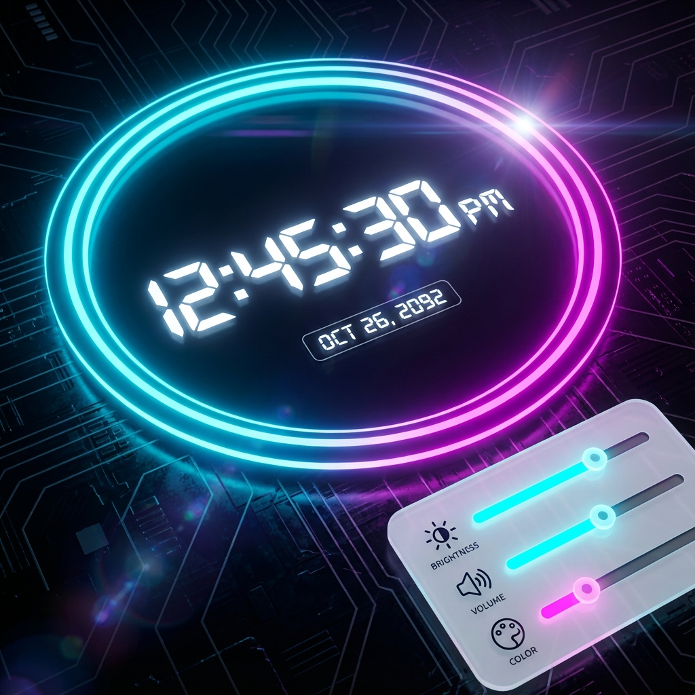

# CyberClock ⏰

A futuristic **Neon Digital Clock** that brings a cyberpunk aesthetic to your browser. Built with vanilla HTML, CSS, and JavaScript, featuring a fully responsive design, glassmorphism UI, and customizable settings.



## 🚀 Features

- **Neon Aesthetic**: Glowing borders and text with dynamic animations.
- **Glassmorphism UI**: A modern, translucent settings panel with blur effects.
- **Responsive Design**: adjust seamlessly to Mobile, Tablet, and Desktop screens.
- **12-Hour Format**: Real-time clock with AM/PM indicator in the background.
- **Customizable**: Interactive settings to adjust clock size, glow intensity, border width, and animation speed.
- **Smooth Animations**: Fluid transitions and rotating elements.

## 🛠️ Built With

- **HTML5**: Semantic structure.
- **CSS3**: Advanced properties like `@property` for conic gradients, flexbox, and media queries.
- **JavaScript**: DOM manipulation and time calculation logic.

## 📂 Project Structure

```
CyberClock/
├── assets/          # Images and assets
│   └── preview.png
├── index.html       # Main HTML structure
├── style.css        # Styles and animations
└── script.js        # Logic and functionality
```

## 📦 How to Use

1.  Clone the repository:
    ```bash
    git clone https://github.com/codebysrk/CyberClock.git
    ```
2.  Open `index.html` in your browser.
3.  Click the **Settings Gear Icon** ⚙️ to customize the look and feel.

## 🤝 Contribution

Contributions are welcome! Feel free to open an issue or submit a pull request.

## 📄 License

This project is open-source and available under the [MIT License](LICENSE).
